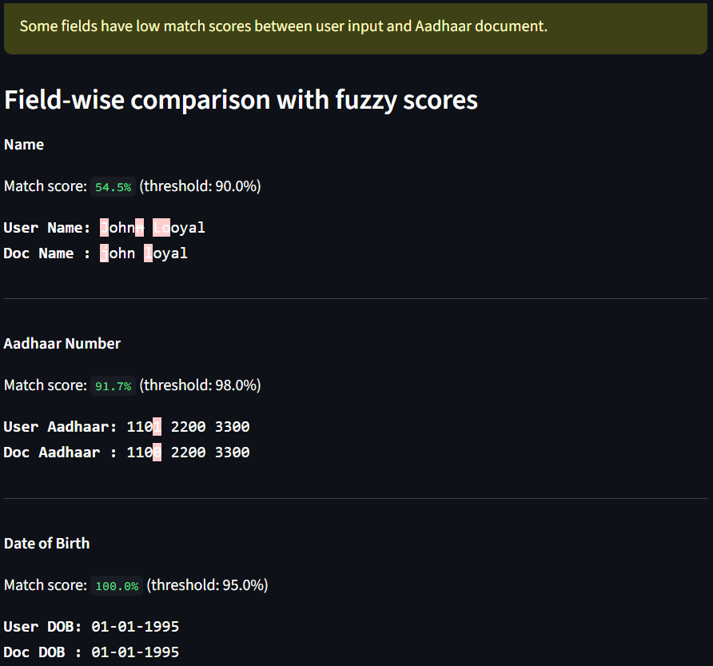
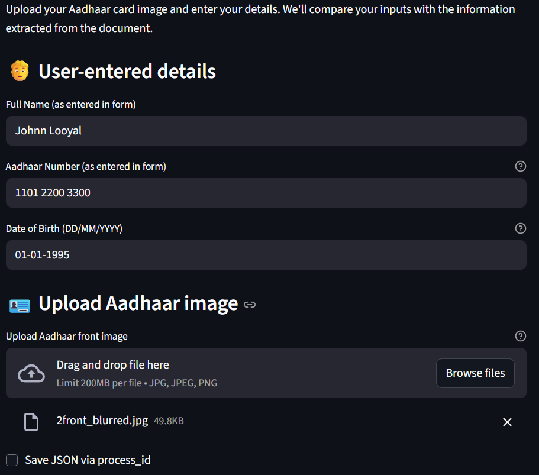

# KYC Document Validation

This repository contains multiple approaches to KYC (Know Your Customer) document validation and information extraction, primarily focused on Indian identity documents such as Aadhaar and PAN cards. The objective is to extract structured key fields, including **Name**, **Aadhaar Number**, and **Date of Birth**, from uploaded ID images.

The project explores and benchmarks three different pipelines:
1. **YOLOv11 + PaddleOCR**
2. **DoNut (Document Understanding Transformer)**
3. **LayoutLM (FUNSD + SROIE fine-tuned)**

---

## Model Descriptions

### 1. YOLOv11 + PaddleOCR (Best Performing)

The **YOLOv11 + PaddleOCR** method achieved the most accurate results for Aadhaar and PAN card text extraction.

Pipeline overview:
- Detection of text regions using **YOLOv11**
- Extraction of text from detected regions via **PaddleOCR**
- Consolidation of recognized text into structured JSON format

#### Output Format Example

```json
{
  "name": "John Doe",
  "aadhar_number": "1234 5678 9012",
  "date_of_birth": "01/01/2000"
}
```

This pipeline consistently provides the cleanest and most reliable extraction results.

### 2. DoNut (Document Understanding Transformer)

**DoNut** is a transformer-based approach for end-to-end document extraction without requiring an OCR engine.

Performs well on structured and templated forms

Underperforms on Aadhaar cards due to variable design and absence of proper labelling for numbers and names

Included code supports experimentation and adaptation for document understanding tasks.

### 3. LayoutLM

**LayoutLM** is a multimodal transformer model combining textual, visual, and spatial layout information.

Pretrained on the FUNSD dataset

Fine-tuned on the SROIE dataset

Performs moderately well on form-like documents

Extracts information poorly from Aadhaar cards compared to the YOLOv11 + PaddleOCR pipeline

### Output screenshots




